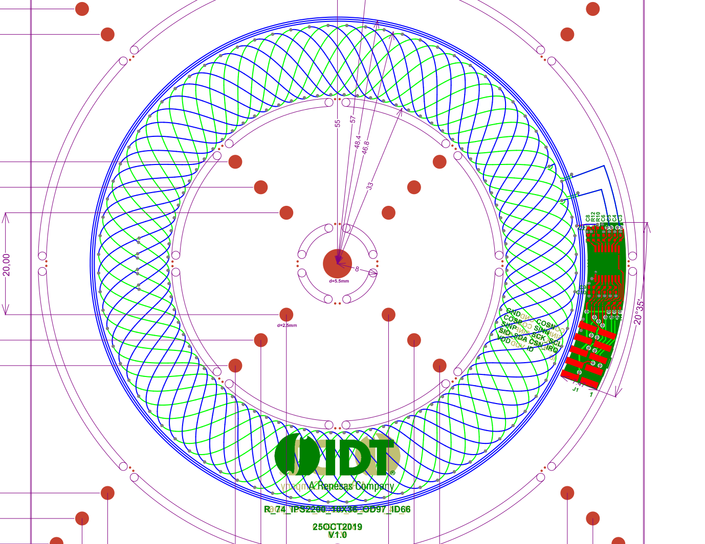

# induction_encoder
python scripts and other files to generate induction encoder PCBs in Kicad

Targeting the Renesas IPS2200 encoder chips.
https://www.renesas.com/us/en/products/sensor-products/position-sensors/ips2200-inductive-position-sensor-high-speed-motor-commutation

Work in progress but feel free to play around!

The goal is to generate the complex part of these sensor PCBs in Kicad. It should
be noted that Renesas offers PCB coil design software, but that software requires
an account and you must ask permission to use it. And it only generates gerber
or Altium files. There is an online altium to kicad converter that is open source:
http://www2.futureware.at/KiCad/

But I would prefer to generate the Kicad PCB directly using simple python code.
Once you generate the fancy curves of the sensor you can lay out the part with
the chip by hand as normal.

Compare the following example board from Renesas to the program output above:

